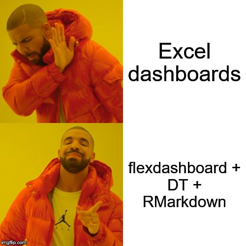
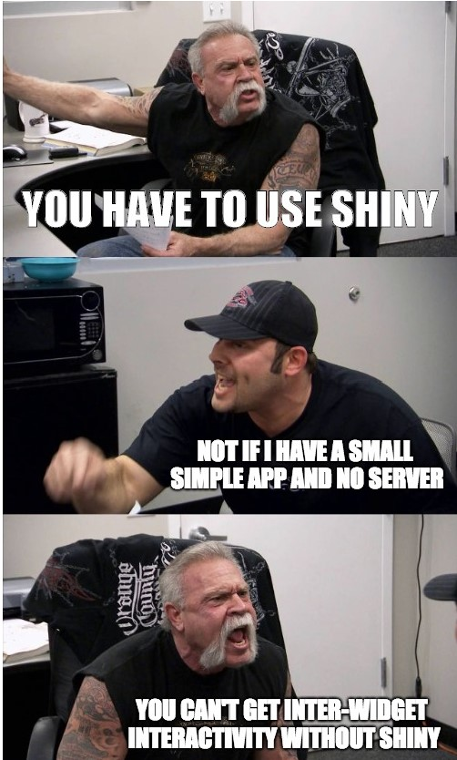
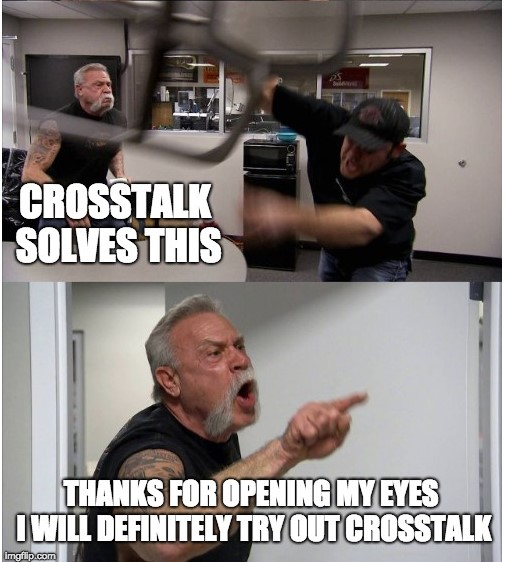
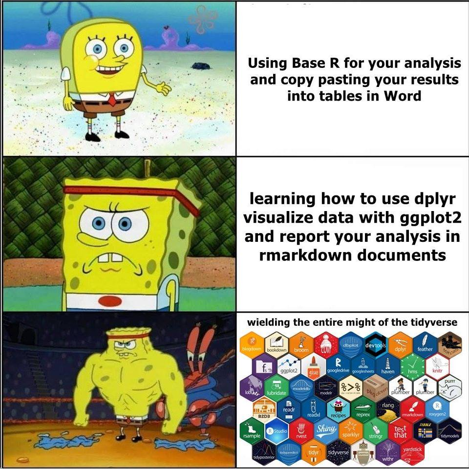

class: middle

.pull-left[

# A Conversation on R Markdown
## 10/29/2021
## Zhaoshan "Joshua" Duan
### Data Science Club @ CSU East Bay

]

.pull-right[

]

???

- Introduction 
- my fav tool
- not purely beginner tutorial, some advanced
- back and forth: presentation vs. live demo

---

```{css, eval = TRUE, include = FALSE}
/* custom.css */

.title-slide {
  background-image: url(marvel-back.png);
}

.left-code {
  color: #777;
  width: 38%;
  height: 92%;
  float: left;
  font-size: small;
}

.right-code {
  color: #777;
  width: 38%;
  height: 92%;
  float: right;
  font-size: 50%;
}

.right-plot {
  width: 60%;
  float: right;
  padding-left: 1%;
}

.bold-blue{
  color: blue;
  font-weight: bold;
}
  

.bold-red{
  color: red;
  font-weight: bold;
}

.remark-code{line-height: 1.5; font-size: 70%}

.tiny .remark-code { 
  font-family: 'Source Code Pro', 'Lucida Console', Monaco, monospace;
  font-size: 40%; !important;
  }
  
```

# Acknowledgement

.pull-left[
### Rstudio Live Stream By Thomas Mock (August 26, 2021)
]

.pull-right[

### "Advanced R Markdown"

]

???
- inspiration
- not completely the same
- different focus 

---

.pull-left[
# RMarkdown Taxonomy


]

.pull-right[

### 1. Literate Programming
### 2. Data Products
### 3. Control Documents
### 4. Templating

] 

???
- rmarkdown is a lot more than literate programming 
- end of pipeline 
- data product: dashboard, slide deck 
- (fav) control: workflow organization 
- template

---

.pull-left[

# Literate Programming 

## A Programming Paradigm 

Capture code, text/comments, and output in a integrated format. 

> Let us change our traditional attitude to the construction of programs: Instead of imagining that our main task it to instruct a *computer* what to do, let us concentrate rather on explaining to *human beings* what we want a computer to do.

> \- David Knuth, *Literate Programming* 1986

]

.right-code[

````markdown
---
title: "Penguins"
data: 2020-08-11
output: html_document
---

`r ''````{r setup, include=FALSE}

library(ggplot2)
library(dplyr)
library(palmerpenguins)
library(reticulate)
use_condaenv("r-reticulate")

smaller <- penguins %>% 
  filter(body_mass_g <= 4000)
```

The Adelie penguins are smaller than the other types 
of penguins. The plot generated above indicated a 
distribution of penguins weighing less than 4 kilograms.

`r ''````{r echo=FALSE}
smaller %>% 
  ggplot(aes(body_mass_g)) + 
  geom_histogram(binwidth = 100)
```
````
]


???
- paradigms: OOP, functional, meta
- philosophy rather than category 
- aligns with Data Science
- need to provide reasoning to do certain things (can be mathematically rigorous)
- as well as to explain metrics, translating that to practical matters depending on the context of the problem 
---

.pull-left[
## Visual RMarkdown 

Live as of RStudio 1.4 (released in Jan-21 2021)

This is a WYSIWYM editor: 
- easier $\LaTeX$
- citations support 

[Visual Editor Guide](https://rstudio.github.io/visual-markdown-editing/)
]


.pull-right[


]

???
- rendered output

---

## Other Languages Capability

* Python via `{reticulate}`
* SQL
* CSS or Javascript
* Bash, Rcpp, Stan, and others

All together a total <span style="color:red;font-weight:bold">52</span> possible language engines from `{knitr}`.

---

### Data Product 

* Reports - HTML, PDF, RTF, Github document
* Presentations - `xaringan`, Powerpoint, `reveal.js`, beamer
* Dashboards - `flexdashboard` either as static or with `shiny`
* Entire websites - `blogdown`, `distill`
* Books via `bookdown`
* HTMLWidgets - `DT`, `reactable`, `plotly`, `crosstalk` and more. 

???
- surprising

---

# Crosstalk ? CROSSTALK ! 

.pull-left[

]

.pull-right[

]

---

.pull-left[
# Control Document
## - Modulaize Tasks
## - workflow control 
]

.pull-right[

]

???
- biggest take-away from the live stream
- multiple RMD referencing R, mutliple R scripts

---

### Reference .R files

.pull-left[

````markdown
---
title: "Penguins"
date: 2020-08-11
output: html_document
---
`r ''````{r setup, include = FALSE}
library(tidyverse)
library(palmerpenguins)
knitr::read_chunk(‘penguins.R’)
```

`r ''````{r, smaller-penguins, echo = FALSE}
```

We have data about `r knitr::inline_expr("nrow(penguins)")` 
penguins.

`r ''````{r, plot-penguins, echo = FALSE}
```
````
]

.pull-right[
#### `penguins.R`
```{r, eval = FALSE}
## ---- smaller-penguins
smaller <- penguins %>% 
  filter(species == "Adelie”, 
         !is.na(body_mass_g))
## ---- plot-penguins
smaller %>% 
  ggplot(aes(body_mass_g)) + 
  geom_histogram(binwidth = 100)
```

]

---


### Knit with Parameters

````markdown
---
title: "Penguins"
date: 2020-08-11
output: html_document
params:
  species: Adelie
---
`r ''````{r setup, include = FALSE}
library(tidyverse)
library(palmerpenguins)
smaller <- penguins %>% 
  filter(species == params$species, 
         !is.na(body_mass_g))
```
We have data about `r knitr::inline_expr("nrow(penguins)")`  penguins.  Only 
`r knitr::inline_expr("nrow(penguins) - nrow(smaller)")` are classified as
`r knitr::inline_expr("params$species")`. The distribution of the 
`r knitr::inline_expr("params$species")` penguins are shown below:
`r ''````{r, echo = FALSE}
smaller %>% 
  ggplot(aes(body_mass_g)) + 
  geom_histogram(binwidth = 100)
```
````

???
- generate reports for each params 
- an opportunity for third-person view point. 
- whole picture of the pipeline 
- workflow 

---

# Child Documents

.pull-left[

### adelie-report.Rmd

````markdown

---
output: html_document
---
`r ''````{r, echo = FALSE}
smaller <- penguins %>% 
  filter(species == "Adelie", 
         !is.na(body_mass_g))
```
We have data on `r knitr::inline_expr("nrow(penguins)")` penguins.
The distribution of the Adelie 
penguins are shown below:

`r ''````{r, echo = FALSE}
smaller %>% 
  ggplot(aes(body_mass_g)) + 
  geom_histogram(binwidth = 100)
```

````
]

.pull-right[

### Parent Document

Uses the child document by name.

````markdown
---
title: "Penguins"
date: 2020-08-11
output: html_document
---


`r ''````{r setup, include = FALSE}
library(tidyverse)
library(palmerpenguins)
```

`r ''````{r, child=c("adelie-report.Rmd”)}
```
````

]

??? 
- changing output format 

---

# Logical Child documents

.pull-left[

### report.Rmd

````markdown
---
output: html_document
---

`r ''````{r, echo = FALSE}
smaller <- penguins %>% 
  filter(species == "Adelie", 
         !is.na(body_mass_g))
```
We have data on `r knitr::inline_expr("nrow(penguins)")` penguins.
The distribution of the Adelie 
penguins are shown below:

`r ''````{r, echo = FALSE}
smaller %>% 
  ggplot(aes(body_mass_g)) + 
  geom_histogram(binwidth = 100)
```

````
]

.pull-right[

````markdown
---
title: "Penguins"
date: 2020-08-11
output: html_document
---


`r ''````{r setup, include = FALSE}
library(tidyverse)
library(palmerpenguins)

sp <- "Chinstrap"
```

`r ''````{r, child=if (sp == "Adelie”) "report.Rmd”}
```
````

Uses report code only if specific condition is met.

]

???
- outlier report 
- certain threshold 
- re-use part of different files 
- incentives us to write general, abstract 

---

.pull-left[

# Blastula Emails

````markdown
---
title: "Penguins"
date: 2020-08-11
output: html_document
---

`r ''````{r setup, include = FALSE}
library(tidyverse)
library(blastula)
```
`r ''````{r penguin-plot, echo = FALSE}
palmerpenguins::penguins %>% 
  filter(species == "Adelie", 
         !is.na(body_mass_g)) %>% 
  ggplot(aes(body_mass_g)) + 
  geom_histogram(binwidth = 100)
```

`r ''````{r connect_email, echo = FALSE}
render_connect_email(
  input = "penguin-email.Rmd”) %>%
  attach_connect_email(
    subject = "Penguin Report")
```
````

]

.pull-right[

### `penguin-email.Rmd`

````markdown
---
title: "Penguins Report"
date: 2020-08-11
output: blastula::blastula_email
---

`r ''````{r packages, include = FALSE}
library(tidyverse)
library(palmerpenguins)
```

Important update on the state of 
the penguins!

`r ''````{r penguin-plot, echo = FALSE}
```
````
When parent document is rendered, it generates a HTML email, can include arbitrary R output like `ggplot2` or even tables.

]

???
- haven't used it 
- cool feature 

---

class:middle
.pull-left[
## Templating 

Generate input templates or output documents from code. 

]

.pull-right[

]

???
- the parameter example 
- Input templates 
- output templates 

---

.pull-left[

````markdown
---
title: "Penguins"
date: 2020-08-11
output: html_document
params:
  species: Adelie
---

`r ''````{r setup, include = FALSE}
library(tidyverse)
library(palmerpenguins)

smaller <- penguins %>% 
  filter(species == params$species, 
         !is.na(body_mass_g))
```
We have data about `r knitr::inline_expr("nrow(penguins)")` penguins. 
The distribution of the 
`r knitr::inline_expr("params$species")` penguins are shown below:

`r ''````{r, echo = FALSE}
smaller %>% 
  ggplot(aes(body_mass_g)) + 
  geom_histogram(binwidth = 100)
```
````
]

.pull-right[

```{r, eval = FALSE}
rmarkdown::render(
  “penguin.rmd”,
  params = list(species = “Gentoo”)
)
```

Uses report code with new parameter.

]

---

.pull-left[

````markdown
---
title: "Penguins"
date: 2020-08-11
output: html_document
params:
  species: Adelie
---

`r ''````{r setup, include = FALSE}
library(tidyverse)
library(palmerpenguins)

smaller <- penguins %>% 
  filter(species == params$species, 
         !is.na(body_mass_g))
```
We have data about `r knitr::inline_expr("nrow(penguins)")` penguins. 
The distribution of the 
`r knitr::inline_expr("params$species")` penguins are shown below:

`r ''````{r, echo = FALSE}
smaller %>% 
  ggplot(aes(body_mass_g)) + 
  geom_histogram(binwidth = 100)
```
````

]

.pull-right[

```{r, eval = FALSE}
render_fun <- function(penguin){
  rmarkdown::render(
    input = "penguins-report.rmd",
    params = list(species = penguin),
    output_file = glue::glue(
      "{penguin}-report.html"
      )
  )
}

distinct(penguins, as.character(species)) %>% 
  pull() %>% 
  purrr::walk(render_fun)
```

```
Adelie-report.html 
Chinstrap-report.html 
Gentoo-report.html
```

]

???
- extend to different combination of certain threshold 
- changing time 
- for different models 

---


.pull-left[

## Loop within a doc 


````markdown
---
title: "Penguin Report"
output: html_document
---
  
`r ''````{r penguin function, include=FALSE}
library(tidyverse)
library(palmerpenguins)
library(glue)
knitr::opts_chunk$set(echo=FALSE, fig.width=6, 
  message=FALSE)
source(“multiplot.R”)
penguins <- palmerpenguins::penguins %>% 
  filter(!is.na(bill_length_mm),  
   !is.na(flipper_length_mm))
```

`r ''````{r loop-output, results="asis"}
penguins %>% 
  distinct(species) %>% 
  pull(species) %>% 
  as.character() %>% 
  walk(multiplot)
```
````
]

.pull-right[
#### `multiplot.R`
```{r, eval = FALSE}
multiplot <- function(penguin_name){
  glue("  \n### {penguin_name}  \n  \n") %>% cat() 

  df_pen <- penguins %>% 
    filter(as.character(species) == penguin_name)
  
  flipper_len <- df_pen %>% 
    summarize(mean = mean(flipper_length_mm)) %>% 
    pull(mean) %>% 
    round(digits = 1)  

  glue::glue("There are {nrow(df_pen)} observations of {penguin_name} penguins. The average flipper length is {flipper_len}.  \n") %>% cat()

  plot_out <- df_pen %>% 
    ggplot(aes(x = bill_length_mm, 
               y = flipper_length_mm)) +
    geom_point() +
    labs(x = "Bill Length", 
         y = "Flipper Length", 
         title = penguin_name)
  
  print(plot_out)

  cat("  \n  \n")
}
```

]
???
- generate multiple report by one rmd
- generate multiple things in one report 

---

# `whisker` vs `glue`...

--
... is `{one}` vs `{{two}}`

--

```{r}
# logic templating
glue::glue("There are {nrow(mtcars)} rows in the mtcars dataset")
```

--

```{r}
rows_in <- nrow(mtcars)
whisker::whisker.render('There are {{rows_in}} rows in the mtcars dataset')
```

--

```{r}
# logicless templating
whisker::whisker.render('There are {{nrow(mtcars)}} rows in the mtcars dataset')
```


???
- glue: logic template, will interpret
- never used whisker before 
- whisker: logicless, not interpreting the expression but using the variable
- where whisker is great is generating .rmd file 
- generate new input files from input files 

---

.pull-left[

````markdown
---
title: "{{species}} Penguin"
output: html_document
---
`r ''````{r setup, include = FALSE}
library(tidyverse)
library(palmerpenguins)

smaller <- penguins %>% 
  filter(species == “{{species}}”, 
         !is.na(body_mass_g))
```
We have data about `r knitr::inline_expr("nrow(penguins)")` penguins.
The distribution of the {{species}} penguins are shown below:

`r ''````{r, echo = FALSE}
smaller %>% 
  ggplot(aes(body_mass_g)) + 
  geom_histogram(binwidth = 100)
```
{{long_prose}}
````

]

.pull-right[

````markdown
---
title: "Adelie Penguin"
output: html_document
---
`r ''````{r setup, include = FALSE}
library(tidyverse)
library(palmerpenguins)

smaller <- penguins %>% 
  filter(species == Adelie, !is.na(body_mass_g))
```
We have data about `r knitr::inline_expr("nrow(penguins)")` penguins. 
The distribution of the Adelie penguins are shown below:
`r ''````{r, echo = FALSE}
smaller %>% 
  ggplot(aes(body_mass_g)) + 
  geom_histogram(binwidth = 100)
```
### Mating
The mating season begins with the Antarctic spring in October.
The penguins create nests by piling little stones in circles. 
Once the egg is laid in December the parents take turns incubating the egg and going to hunt. 
The parent that stays behind does not eat during their turn with the egg. 
Once the hatched chick is about 3 weeks old both parents will abandon it, returning to the sea to hunt. 
The downy chicks gather into a group called a crèche to keep each other warm. 
They will start to hunt at about 9 weeks old once their down has been replaced with waterproof feathers.
````

]

---

### `whisker` function

```{code, eval = FALSE}
use_penguin_template <- function(species, long_prose){
  
  raw_rmd <- readLines("penguin-whisker.Rmd")
  
  filled_rmd <- whisker::whisker.render(raw_rmd)
  
  writeLines(
    text = filled_rmd,
    con = glue::glue("{species}-report.rmd")
  )
}
```
```text
species <- "Adelie"

long_prose <- "### Mating\n\nThe mating season begins with the Antarctic spring in October.
The penguins create nests by piling little stones in circles. 
Once the egg is laid in December the parents take turns incubating the egg and going to hunt. 
The parent that stays behind does not eat during their turn with the egg. 
Once the hatched chick is about 3 weeks old both parents will abandon it, returning to the sea to hunt. 
The downy chicks gather into a group called a crèche to keep each other warm. 
They will start to hunt at about 9 weeks old once their down has been replaced with waterproof feathers."
```
```{r, eval = FALSE}
use_penguin_template(species, long_prose)
```

---

.pull-left[

### Follow-up reading

* Emily Riederer’s [RMD Driven Development](https://emilyriederer.netlify.app/post/rmarkdown-driven-development/)  

* Sharla Gelfand’s [RMD templating](https://sharla.party/post/usethis-for-reporting/)  

* Thmoas Mock Meta RMarkdown [blogpost](https://themockup.blog/posts/2020-07-25-meta-rmarkdown/)  
* The fantastic [RMarkdown Cookbook](https://bookdown.org/yihui/rmarkdown-cookbook/)  

* RMarkdown [Definitive Guide book](https://bookdown.org/yihui/rmarkdown/)  

* [Rethinking Reporting with Automation](https://www.rstudio.com/resources/webinars/rethink-reporting-with-automation/) within the Insurance Industry  

* Using R to Enhance [Clinical Reporting](https://www.rstudio.com/resources/webinars/using-r-to-drive-agility-in-clinical-reporting/) within the Life Sciences industry  


* One of my favorites, [Julia Silge](https://juliasilge.com)]

.pull-right[


]

---


### Other Talks

.pull-left[

# Rob Hyndman @ Rstudio::Conference2020


]


.pull-right[

# Xie Yihui @ Rstudio::Conference2020


]

---
.pull-left[
## Closing Thoughts
]

.pull-right[

]


